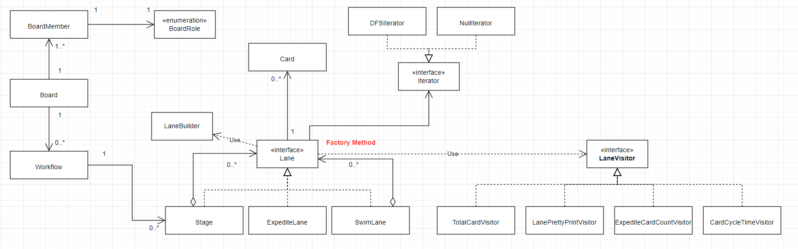
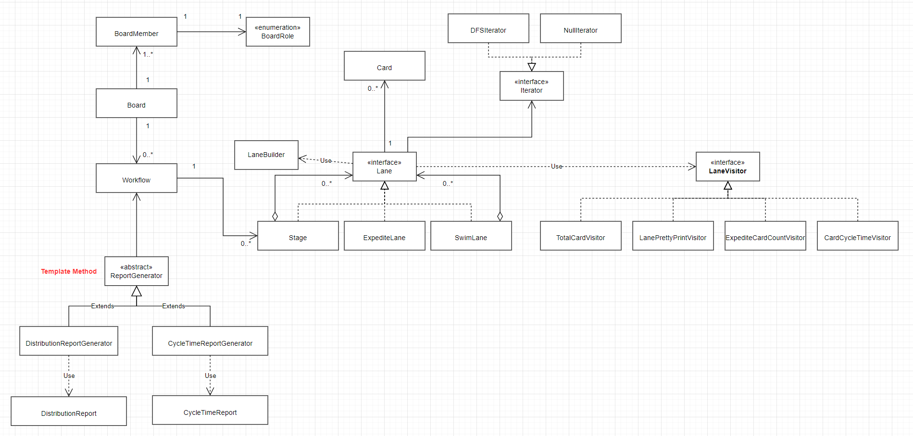
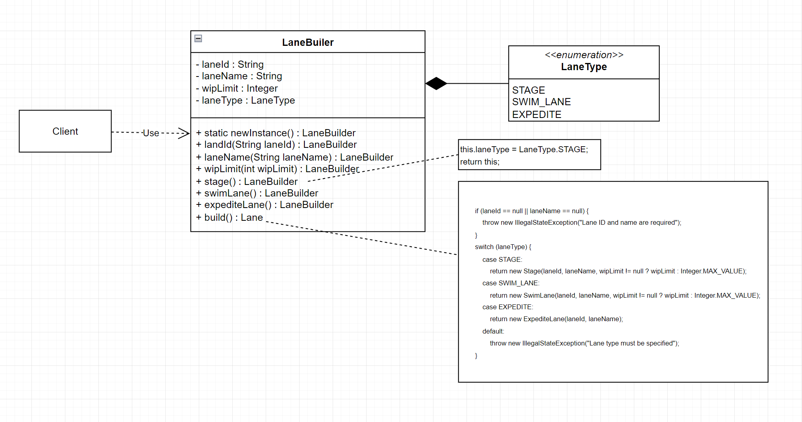

# Pattern Oriented Software Design - Term project

### 更改項目: 
  1. 新增Sequence Diagram(12/30 13:12:04)
  2. 新增demo.png in Description(1/2 13:44)
  3. 新增一張method chaing圖片在Builder部分、修改StoryBoard pattern出現的順序、修改Pattern Summary and StoryBoard的class diagram，
     BoardMember和BoardRole之間的關係。(1/5 15:28)
## notEzKanban

Team members:

- 113598009 李俊威
- 113598029 李致中
- 113598035 莊靜修

## Problem Statement
在快速變動的工作環境中，團隊經常面臨任務可視性不足、優先順序混亂以及缺乏高效協作的挑戰，這些問題導致工作進度延誤和資源浪費。
當前的工作流程缺乏一個系統化的管理方式來提升透明度，幫助團隊明確責任分配，並及時發現和解決瓶頸問題。因此，我們需要一個Kanban系統來將工作流程可視化，優化任務優先順序，促進高效協作，並提升整體流程的效率和成果。

## Description

本專題將著重在以 Java 開發一個簡單的 Kanban 系統，負責管理團隊的工作流程。這個系統首先需要具備任務卡片管理的能力，
首先要能夠讓使用者創建、編輯、刪除卡片，並透過拖放操作將卡片移動到不同的工作階段（如「待辦事項」、「進行中」和「已完成」）。第二個是可以提供看板資訊報告，讓團隊成員能夠清楚地了解工作的進展情況，並及時調整工作優先順序。

## Future
此專題未來可以實作Kanban Game功能，讓使用者透過遊戲化的方式學習Kanban的概念，並透過遊戲的方式提升團隊的協作能力。透過Event紀錄Kanban的所有狀態，方便日後能夠回顧看板的所有活動。利用即時通訊軟體的Webhook功能，傳送Kanban即時通知給該看板使用者，讓使用者能在離線時通過手機得知看板資訊。

## Design Patterns Summary & Storyboard 
### 因為Class Diagram有點大，所以細節的Diagram放在各個Pattern的中
### Design Patterns Summary

### Storyboard
Composite -> Builder -> Visitor -> Iterator -> Factory Method -> Template Method

1. Composite  

2. Builder

3. Visitor

4. Iterator

5. Factory Method

6. Template Method

## Design Patterns in Our Code
### Composite

- Motivation:
看板系統中，每個 Stage 、 SwimLane 、 ExpediteLane都是一種 Lane，且每個 Lane 中可能包含多個 Lane。
- Solution:
使用 Composite pattern 表達 Lane 與 Lane 之間的關係。
- Consequence:
  - client 不用關心它正在操作的是單個 Lane 還是組合 Lane。
  - 易於擴展新的 Lane 類型。
  - 新增功能可能會頻繁修改 Lane 介面。
### Builder

- Motivation:
  由於 Lane 有多個屬性，用 constructor 建構時參數很多，導致可讀性很差。
- Solution:
  使用 Builder pattern 以避免傳入過多參數時造成混亂。
- Consequence:
  - 利用 builder 去統一產生複雜的物件。
  - 透過 Method Chaining 方法，可以選擇性設置某些參數，而不用處理 constructor overloading。
### Visitor

- Motivation:
  除了維護 Lane 結構、Card的操作的職責外，不希望像是增加計算卡片數量功能而去修改到 Lane 介面本身。
- Solution:
  使用 Visitor pattern 將其邏輯抽到另一個類別中，讓操作邏輯和類別本身分離。
- Consequence:
  - 易於擴展新操作。
  - 保持 Lane 介面職責乾淨。
  - 不需因為新增功能而修改介面。
  - 集中操作邏輯，易於維護，可讀性高。
  - 如果要新增 Lane 的具體實作會破壞LaneVisitor的OCP。
### Iterator

- Motivation:
  由於 Lane 是 composite 的結構，像是我們要取得所有卡片數量時，需要遍歷這個樹狀結構。
- Solution:
  使用 Iterator pattern ，因應不同遍歷需求在 Lane Interface 上面呼叫對應的 iterator method。
- Consequence:
  - 簡化遍歷邏輯。
  - 外部只需與 iterator 互動，而不用知道內部具體實作。
  - 可以透過實作多種 iterator，實現不同遍歷方式。
### Factory Method

- Motivation:
  非composite的concrete Lane不需要iterator traverse 自己。
- Solution:
  使用 Factory Method pattern ，在Lane介面上提供一個NullIterator，讓leaf取得NullIterator。
- Consequence:
  - 介面上使用default會讓日後新增concrete class忘記去override該method。
  - 不需要在leaf上實作iterator。
### Template method

- Motivation:
  希望能夠reuse生成報表時的流程，但不同報表的資料收集邏輯不同。
- Solution:
  利用 template method 定義報表生成的標準流程 (generateReport)，子類別負責具體的資料收集邏輯。
- Consequence:
  - 可以把 concrete ReportGenerator 重複的程式碼放到 superclass 裡 
  - client被限制只能使用固定的流程，如果之後生成報表流程更改的話就會破壞抽象層的OCP
## ref
[ezKanban](https://gitlab.com/TeddyChen/ezkanban_2020)