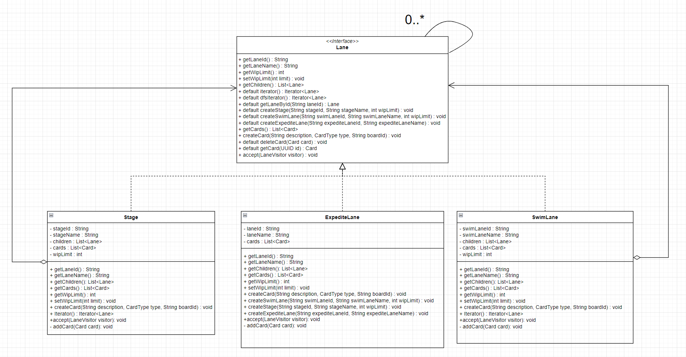

# Pattern Oriented Software Design - Term project

## notEzKanban

Team members:

- 113598009 李俊威
- 113598029 李致中
- 113598035 莊靜修

## Problem Statement
在快速變動的工作環境中，團隊經常面臨任務可視性不足、優先順序混亂以及缺乏高效協作的挑戰，這些問題導致工作進度延誤和資源浪費。
當前的工作流程缺乏一個系統化的管理方式來提升透明度，幫助團隊明確責任分配，並及時發現和解決瓶頸問題。因此，我們需要一個Kanban系統來將工作流程可視化，優化任務優先順序，促進高效協作，並提升整體流程的效率和成果。

## Description
本專題將著重在以 Java 開發一個簡單的 Kanban 系統，負責管理團隊的工作流程。這個系統首先需要具備任務卡片管理的能力，
首先要能夠讓使用者創建、編輯、刪除卡片，並透過拖放操作將卡片移動到不同的工作階段（如「待辦事項」、「進行中」和「已完成」）。第二個是透過通知機制提醒該看板成員看板的狀態變化。第三個是可以提供工作進度的報告，讓團隊成員能夠清楚地了解工作的進展情況，並及時調整工作優先順序。

## Future
此專題未來可以實作Kanban Game功能，讓使用者透過遊戲化的方式學習Kanban的概念，並透過遊戲的方式提升團隊的協作能力。透過Event紀錄Kanban的所有狀態，方便日後能夠回顧看板的所有活動。利用即時通訊軟體的Webhook功能，傳送Kanban即時通知給該看板使用者，讓使用者能在離線時通過手機得知看板資訊。

## Technique

## Design Patterns Summary & Storyboard 

## Design Patterns in Our Code
### Composite

- Motivation:
看板系統中，每個 Stage 或 SwimLane 都是一種 Lane，且每個 Lane 中可能包含多個 Lane。
- Solution:
使用 Composite pattern 表達 Lane 與 Lane 之間的關係。
- Consequence:
  - client 不用關心它正在操作的是單個 Lane 還是組合 Lane。
  - 添加新功能時，只需在 Lane interface 中添加 default method 即可，而不需要修改 concrete class。
  - 易於擴展新的 Lane 類型。
### Builder

- Motivation:
  由於 Lane 有多個屬性，用 constructor 建構時參數很多，導致可讀性很差。
- Solution:
  使用 Builder pattern 透過 Method Chaining 的方式設置屬性以避免傳入過多參數時造成混亂。
- Consequence:
  - 利用 builder 去統一產生複雜的物件。
  - 透過 Method Chaining 方法，可以選擇性設置某些參數，而不用處理 constructor overloading。
### Iterator

- Motivation:
  由於 Lane 是 composite 的結構，像是我們要取得所有卡片數量時，需要遍歷這個樹狀結構。
- Solution:
  使用 Iterator pattern ，因應不同遍歷需求在 Lane Interface 上面呼叫對應的 iterator method。
- Consequence:
  - 簡化遍歷邏輯。
  - 外部只需與 iterator 互動，而不用知道內部具體實作。
  - 可以透過實作多種 iterator，實現不同遍歷方式。
### Factory Method

- Motivation:
  非composite的concrete Lane不需要iterator traverse 自己。
- Solution:
  使用 Factory Method pattern ，在Lane介面上提供一個NullIterator，讓leaf取得NullIterator。
- Consequence:
  - 介面上使用default會讓日後新增concrete class忘記去override該method。
  - 不需要在leaf上實作iterator。
### Visitor
- Motivation:
  除了維護 Lane 結構、Card的操作的職責外，不希望像是增加計算卡片數量功能而去修改到介面本身。
- Solution:
  使用 Visitor pattern 將其邏輯抽到另一個類別中，讓操作邏輯和類別本身分離。
- Consequence:
  - 易於擴展新操作。
  - 保持介面職責乾淨。
  - 不需修改介面。
  - 集中操作邏輯，易於維護，可讀性高。
### Template method
- Motivation:
  生成報表時有固定的處理流程。
- Solution:
  利用 template method 定義報表生成的標準流程 (generateChart)，子類別負責具體的資料收集邏輯。
- Consequence:
  - 可以讓所有圖表的生成過程保持一致，但數據收集的邏輯可以根據不同圖表類型進行客製化。

### Observer
- Motivation:
  當生成報表時，我們希望能通知其他使用者。
- Solution:
  利用 Observer pattern ，Notifier 作為訂閱者會通知其他使用者或是外部裝置。
- Consequence:
  - 同步資訊，傳送Kanban即時通知給該看板使用者。
### Singleton
- Motivation:
如果 report 直接調用每一個 Notifier，它需要知道所有的通知邏輯和具體實現。導致系統難以擴展，每次增加一種 Notifier 都需要修改 Board 的代碼。
- Solution:
利用 Singleton pattern ，將 EventBus 作為事件發布者，統一將是件通知給每個 Notifier，再讓它們各自去執行具體的通知邏輯。
- Consequence:
  - 解耦事件的發布者與訂閱者。
  - 一個事件可以被多個 Notifier 同時處理。
  - 允許在系統運行時動態增加或移除事件的訂閱者，方便引入新的事件類型或新的處理邏輯，而不影響現有程式。
  - EventBus 作為事件的中心節點，可以統一記錄、追蹤和分析系統中的事件流。
  - 可以方便地加入日誌功能，用於監控或排查問題。
## ref
[ezKanban](https://gitlab.com/TeddyChen/ezkanban_2020)